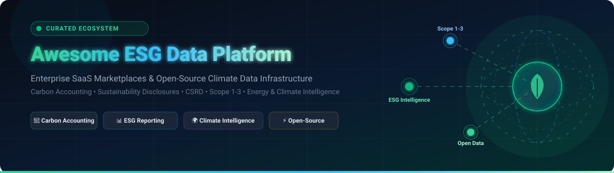
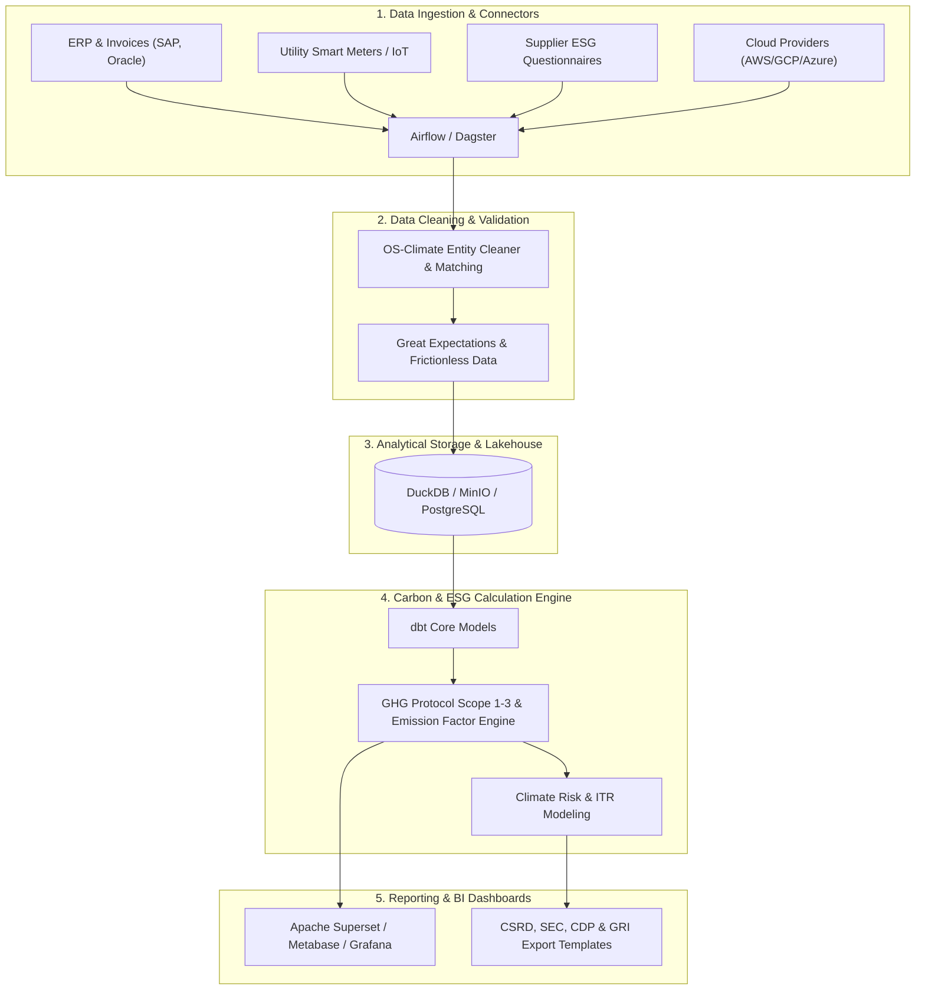

# 🌍 Awesome ESG Data Platform 🌱

**A Curated, SEO-Optimized Awesome List of SaaS Enterprise Platforms & Open-Source Tools for ESG Data Management, Carbon Accounting, Sustainability Disclosures, Climate Intelligence & Scope 1–3 Emissions Tracking.**

*Last updated: August 2026 • Curated with ❤️ for Sustainability Officers, Data Engineers, ESG Analysts & Climate Tech Developers*

---

## 📖 Overview

The **Awesome ESG Data Platform** ecosystem repository tracks leading **Enterprise SaaS platforms** and **open-source data engineering projects** designed for **ESG (Environmental, Social, and Governance) data infrastructure**. 

These platforms enable enterprises, financial institutions, and developers to:
- 📊 **Collect, Normalize & Clean** multi-source ESG data (utility bills, IoT sensors, supply chain surveys, ERPs, legal registries).
- 🌡️ **Calculate Scope 1, Scope 2, and Scope 3 Emissions** in accordance with the GHG Protocol and ISO 14064.
- 📋 **Automate Regulatory Disclosures & Compliance** for CSRD / ESRS, SEC Climate Rules, California SB 253 / SB 261, GRI, SASB, ISSB / IFRS S1 & S2, and CDP.
- 🔗 **Conduct Double-Materiality & Supply Chain ESG Audits** across Tier 1–N vendors.
- 🚀 **Build Custom Self-Hosted ESG Data Warehouses** using cutting-edge open-source analytics engines (DuckDB, dbt, Apache Airflow, Apache Superset, Trino).

---

## 📑 Table of Contents

- [🏢 SaaS & Hosted Platforms (Sorted by Market Cap / Valuation)](#-saas--hosted-platforms)
- [⚡ Open-Source GitHub Projects (Sorted by Stars)](#-open-source-github-projects)
- [🛠️ Additional Open-Source Building Blocks](#️-additional-open-source-building-blocks)
- [🏗️ Reference Architecture: Building a Self-Hosted ESG Platform](#️-reference-architecture-building-a-self-hosted-esg-platform)
- [📈 Star History](#-star-history)
- [🤝 How to Contribute](#-how-to-contribute)
- [⚖️ Disclaimer](#️-disclaimer)

---

## 🏢 SaaS & Hosted Platforms

*Sorted in descending order by enterprise market capitalization / company valuation.*

| Platform | Valuation / Revenue (Company Size) | Description | Pricing (Starting Tier) | Free Tier / Trial Limits |
| :--- | :--- | :--- | :--- | :--- |
| **[Microsoft Cloud for Sustainability](https://www.microsoft.com/en-us/sustainability/cloud)** | ~$3.1T Market Cap / ~$245B Annual Revenue | Enterprise sustainability data model and analytics ecosystem for enterprise emissions tracking, automated ESG connectors, and operational decarbonization. | $4,000/tenant/month ($48,000/year) base Essentials SKU + user SKUs ($12,000/tenant/month for Premium tier) | 30-day free trial with full Premium tier features and Dataverse test environment access |
| **[Oracle Sustainability](https://www.oracle.com/)** | ~$400B+ Market Cap / ~$53B Annual Revenue | Enterprise performance management (EPM) suite extended with ESG metrics, supply-chain sustainability, environmental accounting, and integrated enterprise reporting. | $250 – $500/user/month (Standard Oracle Fusion Cloud EPM subscription with integrated ESG extensions) | Oracle Cloud Free Tier with $300 credits for 30 days plus Always Free cloud services; 30-day guided evaluation for Fusion Cloud EPM |
| **[Greenhouse Gas Management by Salesforce](https://www.salesforce.com/)** | ~$270B+ Market Cap / ~$35B Annual Revenue | Net Zero Cloud sustainability management platform integrated into Salesforce CRM, supporting Scope 1–3 accounting, supplier engagement, and AI-driven audit trails. | ~$48,000/year (Starter tier, billed annually) / ~$210,000/year (Growth tier) | 30-day free trial of Salesforce Net Zero Cloud with pre-configured sustainability dashboards and sample carbon data |
| **[SAP Sustainability Control Tower](https://www.sap.com/)** | ~$250B+ Market Cap / ~$35B Annual Revenue | Holistic ESG recording, reporting, and steering platform natively integrated into SAP ERP / S/4HANA transactional systems for audit-ready CSRD/GRI disclosures. | ~$2,500/month (~$30,000/year base tier, based on 10 active user minimum at ~$250/user/month on SAP S/4HANA Cloud) | 30-day free trial / guided product tour on SAP Discovery Center for ESG metric tracking & regulatory reporting |
| **[IBM Envizi](https://www.ibm.com/products/envizi)** | ~$200B+ Market Cap / ~$62B Annual Revenue | Enterprise ESG suite automating data capture across 500+ data types, utility meter consolidation, GHG emissions calculations, and sustainability framework disclosures. | $45/month (Emissions API & Excel tool) / ~$30,000/year base tier via AWS Marketplace & direct sales for IBM Envizi ESG Suite | 14-day free trial with access to core ESG dashboarding, carbon accounting calculations, and reporting templates |
| **[Enablon](https://www.wolterskluwer.com/en/solutions/enablon)** | ~$40B Market Cap (Wolters Kluwer) / ~$6B Revenue | Industry-standard EHS, operational risk, carbon management, and sustainability disclosure software for global enterprises and industrial leaders. | ~$50,000/year entry-level for risk & sustainability performance modules | No free forever plan; custom enterprise proof-of-concept environment upon request |
| **[Workiva ESG](https://www.workiva.com/)** | ~$4.5B Market Cap / ~$630M Annual Revenue | Connected cloud reporting platform uniting financial reporting, ESG metrics, SEC disclosures, and CSRD compliance with complete audit trails. | ~$25,000/year (Entry-level reporting module for SMB/mid-market; enterprise multi-entity plans average $100,000+/year) | No free forever plan; 14-day guided sandbox pilot available upon qualified enterprise evaluation |
| **[Watershed](https://watershed.com/)** | ~$1.8B Valuation ($100M Series C) | Enterprise climate platform for granular Scope 1–3 emissions measurement, supplier engagement, clean energy procurement, and CSRD / SEC compliance. | ~$30,000 – $50,000/year entry-level enterprise contract for Scope 1–3 carbon accounting & analytics | Free Open CEDA emissions database access (public research access across 148 countries & 400 industries); no full software free trial (demo only) |
| **[EcoVadis](https://ecovadis.com/)** | ~$1.6B Valuation (Global ESG Unicorn) | World-leading supply-chain sustainability rating and assessment platform providing ESG scorecards, risk mapping, and supplier decarbonization benchmarks. | ~$500 – $1,000/year (€400 – €800/year for Basic plan, XS/Small suppliers; Premium starts at ~$1,800 – $3,500/year) | Free Forever Carbon Rating assessment tool for suppliers; 6-week free questionnaire period for invited suppliers prior to scorecard purchase |
| **[Diligent ESG](https://www.diligent.com/)** | ~$1.5B+ Valuation (Insight Partners & Clearlake) | Comprehensive governance, risk, compliance (GRC), and ESG platform facilitating audit-ready metric collection, board reporting, and regulatory disclosures. | ~$5,000/year per feature module (~$20,000 – $40,000/year for full ESG & GRC suite) | No free forever plan; 30-day proof-of-concept / guided pilot available upon enterprise consultation |
| **[Sphera](https://sphera.com/)** | ~$1.4B Valuation (Blackstone Acquired) | Integrated enterprise software and data for ESG performance, Environmental Accounting, Product Life Cycle Assessment (GaBi/LCA), and supply-chain risk. | ~$15,000 – $30,000/year for entry-level Environmental Accounting / Life Cycle Assessment (LCA) modules | 14-day free trial for Sphera LCA (Life Cycle Assessment for Experts); enterprise suite offered via guided demo |
| **[Persefoni](https://www.persefoni.com/)** | ~$500M Valuation ($150M+ Total Funding) | Enterprise Climate Management & Accounting Platform (CMAP) delivering automated GHG emissions calculation, PCAF-aligned financed emissions, and decarbonization planning. | Free (Persefoni Pro) / Paid Advanced tiers start at ~$40,000/year for enterprise carbon & compliance bundles (e.g., California SB 253/261) | Free Forever plan (Persefoni Pro: unlimited Scope 1 & 2 carbon footprint calculations, standard GHG accounting & data sharing for single entity) |
| **[Clarity AI](https://clarity.ai/)** | ~$450M Valuation (SoftBank & BlackRock Backed) | AI-powered sustainability and impact intelligence platform providing portfolio ESG scores, SFDR regulatory metrics, and double-materiality benchmarks. | ~$15,000 – $30,000/year for entry-level sustainability/ESG fund analytics & regulatory screening API | No free forever plan; 14-day API testing sandbox with sample entity data upon enterprise inquiry |
| **[VelocityEHS](https://www.ehs.com/)** | ~$400M+ Valuation (CVC Growth Partners) | EHS & ESG software suite offering operational safety, GHG emissions tracking, hazardous chemical inventory, and corporate sustainability metrics. | ~$10,000 – $25,000/year for entry EHS & ESG metrics tracking package | 14-day free trial for Chemical Management / SDS module; full ESG suite via tailored demo |
| **[Cority](https://www.cority.com/)** | ~$400M+ Valuation (Thoma Bravo Backed) | Enterprise EHSQ and Sustainability Cloud platform empowering organizations to centralize environmental health, carbon accounting, and social impact metrics. | ~$30,000 – $50,000/year for Sustainability Cloud base deployment | No free forever plan; 14-day guided product tour and sandbox demo upon sales request |
| **[Novata](https://www.novata.com/)** | ~$300M Valuation (S&P Global, Ford Foundation) | Specialized ESG data management and benchmarking platform purpose-built for private equity, venture capital, and private company portfolios. | ~$15,000 – $30,000/year for private market GP/LP ESG data collection and benchmarking tier | No free forever plan; 14-day sample dataset & benchmark sandbox demo upon request |
| **[Greenly](https://greenly.earth/)** | ~$200M Valuation ($75M+ Total Raised) | Automated carbon accounting platform tailored for SMEs and mid-market enterprises, with automated ERP/bank integrations and supplier carbon engagement. | ~$1,950 – $3,800/year (~$160 – $315/month starter SME carbon assessment; mid-market/enterprise tiers $12,000+/year) | Free Forever suite of calculators (AI Carbon Calculator, CBAM & CSRD Assessment tools); 14-day trial available via sales consultation |
| **[Sweep](https://www.sweep.net/)** | ~$200M Valuation ($100M Total Raised) | Networked sustainability platform for tracking carbon, biodiversity, and ESG metrics across corporate hierarchies and complex supply chains. | $250/month ($3,000/year starter plan) / $3,600/year AWS Marketplace flat base fee (Growth tier at $800/month) | No free forever plan; 14-day guided proof-of-concept trial upon request for qualified organizations |
| **[Novisto](https://novisto.com/)** | ~$100M+ Valuation (Inovia Capital Series B) | Enterprise sustainability management platform designed to streamline ESG data governance, improve data quality, and accelerate disclosure workflows. | ~CA$40,000/year (~$30,000 USD/year starting tier for core ESG data management & reporting) | No free forever plan; 14-day sandbox access available upon qualified sales demonstration |
| **[Datamaran](https://www.datamaran.com/)** | ~$100M+ Valuation (Morgan Stanley Backed) | AI-driven ESG governance and materiality analysis platform monitoring regulatory developments, stakeholder sentiment, and emerging climate risks. | ~$20,000 – $25,000/year (Base platform subscription for core materiality & ESG risk intelligence modules) | Free community tier via Datamaran Harbor (limited access to ESG insights & benchmarks); no software trial (demo on request) |
| **[Plan A](https://plana.earth/)** | ~$80M Valuation (Lightspeed & SoftBank Backed) | Science-based carbon accounting and decarbonization platform facilitating CSRD compliance, carbon footprint baselining, and net-zero roadmapping. | ~$1,200 – $2,500/month (~$14,400 – $30,000/year for SME/mid-market carbon accounting & CSRD reporting suite) | Free Carbon Footprint Estimator & CSRD Readiness Assessment tools; 14-day pilot upon qualified discovery call |
| **[Sustain.Life](https://www.sustain.life/)** | ~$50M+ Valuation (Acquired by Workiva) | SaaS carbon accounting software designed for rapid onboarding, Scope 1–3 emissions calculations, emissions factor matching, and offset tracking. | $15/employee/month (remote work tracking) / ~$5,000 – $10,000/year for core SMB carbon accounting & ESG platform | Free emissions & ESG calculator tools; 14-day free trial of the carbon accounting platform upon registration/demo |
| **[SINAI Technologies](https://www.sinaitechnologies.com/)** | ~$50M Valuation ($22M Total Raised) | Decarbonization intelligence platform helping heavy emitters and utilities model marginal abatement cost curves (MACC) and forecast climate transition risks. | ~$25,000 – $40,000/year for core emissions measurement and decarbonization scenario planning modules | No free forever plan; 14-day guided proof-of-concept for qualified enterprise decarbonization programs |
| **[Position Green](https://www.positiongreen.com/)** | ~$50M Valuation (Norvestor Backed) | Full-suite sustainability software and advisory ecosystem supporting double materiality, supplier code of conduct tracking, and CSRD compliance. | ~$12,000 – $25,000/year (€10,000 – €20,000/year for base ESG data collection & CSRD readiness suite) | Free forever access to Position Green Academy basic sustainability e-learning courses; no software free trial (demo on request) |
| **[Benchmark ESG](https://www.benchmarkdigital.com/)** | ~$50M Valuation (Benchmark Gensuite) | Enterprise EHS and sustainability digital platform enabling incident reporting, environmental compliance tracking, and ESG disclosure workflows. | ~$20,000 – $40,000/year for baseline ESG / Environmental Compliance module suite | No free forever plan; 30-day interactive guided evaluation / pilot for qualified enterprise teams |
| **[FigBytes](https://figbytes.com/)** | ~$30M Valuation (Acquired by AMCS Group) | Sustainability data platform connecting carbon accounting, water stewardship, waste reduction, and social impact metrics with strategic ESG targets. | ~$20,000 – $35,000/year for core sustainability & carbon data management module | No free forever plan; 14-day interactive product tour / guided pilot on request |

---

## ⚡ Open-Source GitHub Projects

*Sorted in descending order by GitHub stargazer popularity. Click any star badge to visit the project's stargazers community.*

1. **[Grafana](https://github.com/grafana/grafana)**   
   The open and composable observability and data visualization platform. Widely deployed for visualizing operational energy metrics, building emissions, utility telemetry, and ESG KPI dashboards.

2. **[Apache Superset](https://github.com/apache/superset)**   
   Modern enterprise business intelligence and data exploration platform. Provides interactive dashboarding, SQL IDE, and slice-and-dice data exploration for corporate sustainability reporting datasets.

3. **[Metabase](https://github.com/metabase/metabase)**   
   Simple, user-friendly open-source business intelligence tool that allows non-technical sustainability teams to query, filter, and visualize ESG KPIs and carbon data with zero SQL.

4. **[Apache Airflow](https://github.com/apache/airflow)**   
   Industry-standard programmatic workflow orchestration platform. Essential for scheduling automated ESG data extraction, ERP ingestion, emissions-factor pipeline execution, and compliance reporting.

5. **[DuckDB](https://github.com/duckdb/duckdb)**   
   High-performance in-process analytical SQL database engine. Optimal for embedded carbon calculation microservices, parquet-based emissions data lakes, and local ESG data transformations.

6. **[Dagster](https://github.com/dagster-io/dagster)**   
   Next-generation asset-based data orchestrator ideal for declarative ESG data pipelines, tracking data lineage across Scope 1–3 calculation models, and enforcing data quality contracts.

7. **[dbt Core](https://github.com/dbt-labs/dbt-core)**   
   Analytics engineering framework that transforms raw activity data (fuel, electricity, travel) into standardized, documented, and tested GHG accounting data models.

8. **[Trino](https://github.com/trinodb/trino)**   
   Fast distributed SQL query engine for querying federated multi-cloud ESG data architectures, object stores (S3/GCS/MinIO), and enterprise data warehouses at petabyte scale.

9. **[Great Expectations](https://github.com/great-expectations/great_expectations)**   
   Data validation and documentation framework used to enforce data quality rules, detect anomalous carbon readings, and validate supplier ESG questionnaire submissions.

10. **[Electricity Maps Contrib](https://github.com/electricitymaps/electricitymaps-contrib)**   
    Open-source data parsers powering the real-time global electricity grid carbon intensity and hourly emissions factor platform.

11. **[Cloud Carbon Footprint](https://github.com/cloud-carbon-footprint/cloud-carbon-footprint)**   
    Open-source tool to calculate energy consumption (kWh) and carbon emissions (metric tons CO2e) from public cloud infrastructure (AWS, Azure, Google Cloud).

12. **[Frictionless Data (Python)](https://github.com/frictionlessdata/frictionless-py)**   
    Data management framework to describe, extract, validate, and package tabular ESG datasets using standardized Data Package specifications.

13. **[PUDL — Public Utility Data Liberation](https://github.com/catalyst-cooperative/pudl)**   
    Open data engineering pipeline liberating public energy system and utility data (EIA, FERC, EPA) for climate analytics, grid decarbonization, and Scope 2 accounting.

14. **[Carbon-Aware SDK](https://github.com/Green-Software-Foundation/carbon-aware-sdk)**   
    Green Software Foundation SDK that enables applications and background jobs to run at times and in locations where electricity is cleanest.

15. **[CO2.js (Green Web Foundation)](https://github.com/thegreenwebfoundation/co2.js)**   
    JavaScript and npm package for estimating digital service and web traffic carbon emissions using the Sustainable Web Design (SWD) and OneByte models.

16. **[Software Carbon Intensity (SCI) Specification](https://github.com/Green-Software-Foundation/sci)**   
    Standardized specification developed by the Green Software Foundation describing how to calculate carbon intensity scores for software systems.

17. **[CarbonPlan CMIP6 Downscaling](https://github.com/carbonplan/cmip6-downscaling)**   
    Statistical and machine learning climate downscaling pipelines using global CMIP6 climate model projections for physical risk assessment.

18. **[ecoCode Rules (Green Code Initiative)](https://github.com/green-code-initiative/creedengo-rules-specifications)**   
    Static code analysis rules to reduce the energy consumption and environmental footprint of software programs via SonarQube.

19. **[OS-Climate Community Hub](https://github.com/os-climate/OS-Climate-Community-Hub)**   
    Linux Foundation open-source climate and sustainability data platform community hub for physical risk, transition risk, and portfolio alignment tooling.

20. **[Boavizta API](https://github.com/Boavizta/boaviztapi)**   
    Open API providing reference environmental impact and embodied carbon datasets for digital devices, servers, cloud instances, and IT hardware.

21. **[OpenGHG](https://github.com/openghg/openghg)**   
    Open-source cloud platform for atmospheric greenhouse gas measurement, observation data processing, and flux inversion analysis.

22. **[OS-Climate Data Commons](https://github.com/os-climate/os_c_data_commons)**   
    Architecture and data ingestion pipelines for the OS-Climate Data Commons, standardizing access to financial, corporate, and climate datasets.

23. **[CarbonPlan Forest Offsets](https://github.com/carbonplan/forest-offsets)**   
    Open scientific analysis and auditing toolkit for forest carbon offset projects in compliance and voluntary carbon markets.

24. **[CarbonPlan Data Catalog](https://github.com/carbonplan/data)**   
    Data catalogs, cloud-optimized Zarr pipelines, and utilities for accessing planetary-scale climate and environmental datasets.

25. **[OS-Climate Implied Temperature Rise (ITR)](https://github.com/os-climate/ITR)**   
    Python module implementing the Implied Temperature Rise (ITR) methodology for climate portfolio alignment and transition pathway modeling.

26. **[OS-Climate Financial Entity Cleaner](https://github.com/os-climate/financial-entity-cleaner)**   
    Open-source tool to clean, normalize, and reconcile corporate entity names, legal identifiers (LEI), and corporate hierarchies across ESG datasets.

27. **[OS-Climate ESG Matching](https://github.com/os-climate/esg-matching)**   
    Probabilistic entity matching and record linkage toolkit designed to reconcile ESG reporting data with global corporate registry entries.

---

## 🛠️ Additional Open-Source Building Blocks

- **🧮 Scope 1–3 Carbon Accounting Libraries**: Python & Node.js packages for GHG Protocol calculations (activity data × emission factor = CO₂e).
- **🏭 Open Emissions Factor Databases**: Activity-based emissions factor catalogs (EPA GHG Factors, UK DESNZ/BEIS, ADEME Base Empreinte, EXIOBASE).
- **🌪️ Physical Climate Risk Models**: Hydrological flood modeling, heat stress indices, and hurricane damage vulnerability functions.
- **📦 Supply-Chain ESG Tools**: Questionnaires, vendor tier mapping, and supply chain Scope 3 category 1 (purchased goods & services) calculators.
- **📄 NLP / ESG Document Extraction**: Machine-learning pipelines for extracting CSRD/ESRS data points and SASB metrics from PDF annual reports.
- **🌐 Open Legal Entity Resolution (GLEIF)**: Open financial entity infrastructure for resolving ISINs, LEIs, and parent-subsidiary trees.

---

## 🏗️ Reference Architecture: Building a Self-Hosted ESG Platform

---

## 📈 Star History

---

## 🤝 How to Contribute

Contributions are welcome! Please follow these guidelines to keep the list high-quality:

1. 🍴 **Fork the repository**.
2. ✍️ **Add or edit entries** in `README.md` following the existing format.
3. 🏷️ **Include**: Tool name, official URL, concise description, specific pricing, and free tier/trial limits for SaaS, or a star badge for open source.
4. 🌟 **Prioritize genuinely open-source repositories** with active licenses and clear documentation.
5. 🚀 **Submit a Pull Request (PR)** with a brief rationale.

---

## ⚖️ Disclaimer

- This list is **community-curated** for educational, analytical, and technical research purposes — not an endorsement of any vendor or library.
- ESG regulatory frameworks (e.g., CSRD, SEC, California SB 253/261) and disclosure mandates vary across global jurisdictions.
- SaaS licensing models, pricing figures, company valuations, and tier features change frequently over time.
- Verify all calculation methodologies and emission factors against certified accounting standards (GHG Protocol, ISO 14064, PCAF) before publishing external regulatory disclosures.

---

**Made with 💚 for sustainability practitioners, data engineers, ESG analysts, and climate innovators.**

*Let's build open, transparent, and data-driven climate intelligence together.*

